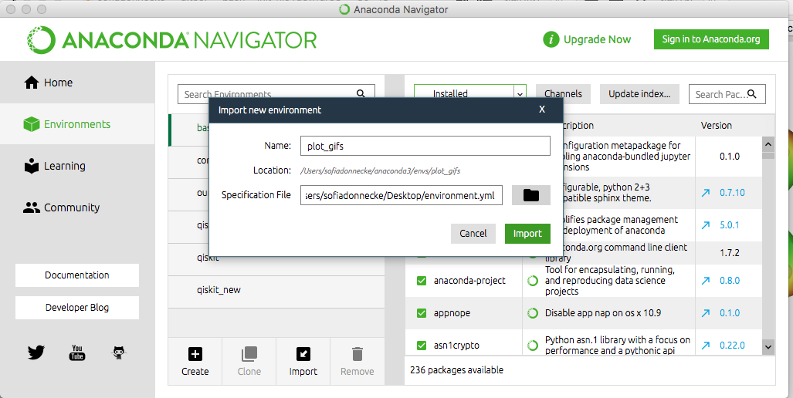

# Making GIFs with python

## Installation

### A) Using Conda in Terminal

```bash
conda env create -f environment.yml
```
This creates a new conda environment called `gifmaker` and install the necessary packages. If you would like to change the name, change the first line in the file environment.yml.

### B) Using Anaconda Navigator
Open Anaconda Navigator and click on Environments on the left panel.
Click on import, add name and select environments.yml from the file browser.
> Note: If the import button is still greyed out after selecting environment.yml, you may need to remove the first line specifying the name in environment.yml. This file can be opened in any text editor.


### C) Using Pip
Once you have created virtual environment using `virtualenv`, you can install all the required packages using
```
pip install -r requirements.txt
```
## Get coding
Import your data and launch the jupyter notebook.
```
jupyter notebook
```
or select the jupyter notebook button in the Anaconda interface to open the notebook. 
